# 🐹 GoVaLite - Lightweight Vault Raft Snapshot Agent

**GoVaLite** is an open-source, ultra-lightweight, high-availability aware, and production-ready Raft Snapshot Agent for HashiCorp Vault, written purely in **Go (Golang)**.

Designed to be a "set and forget" sidecar, it solves common synchronization issues found in distributed clusters by treating your **Storage Backend (S3/Local)** as the single source of truth for scheduling, rather than relying on unreliable internal process timers.

## 🧐 The Problem with Traditional Agents

Existing backup solutions often suffer from critical flaws in **High Availability (HA)** environments:

1.  **Ticker Drift:** If a Standby node restarts at `12:15`, standard cron/ticker logic resets the timer to `13:15`. If the Leader (scheduled for `13:00`) dies at `12:55`, the Standby node won't wake up until `13:15`, leaving a **15-minute gap** in your Disaster Recovery plan.
2.  **Split-Brain / Race Conditions:** In unstable networks, two nodes might momentarily believe they are both the Leader, resulting in corrupt or duplicate snapshot uploads.
3.  **Token Expiration:** Long-running agents often crash when their initial Vault Token expires, requiring manual intervention or container restarts.
4.  **Resource Bloat:** Many agents include heavy frameworks (like Prometheus exporters or Viper config watchers) when you only need a simple, solid backup tool.

## 💡 The GoVaLite Solution

GoVaLite leverages the efficiency of **Go** to solve these problems using a **State-Based Architecture**:

  * **Storage-Centric Scheduling:** The agent does not use a fixed internal clock. Instead, it queries the Storage (S3/MinIO/Local) to find the *actual* timestamp of the last successful snapshot.
      * *Logic:* `Next Run = Last File Timestamp + Frequency`.
      * *Result:* All nodes (Leader & Standby) automatically synchronize their wake-up times to the exact same second, regardless of when they were restarted.
  * **Leader-Only Execution:** Only the active Vault Leader performs the heavy lifting (Snapshotting). Standby nodes simply sync their schedules and sleep, consuming negligible CPU/RAM.
  * **Auto-Healing Authentication:** If the AppRole token expires (403 Error), the agent automatically detects it, re-authenticates with Vault, and retries the operation immediately without crashing.
  * **Atomic Race Check:** Before uploading, the Leader performs a "Double Check" on the storage to ensure no other node has just uploaded a snapshot, preventing race conditions.

## 🏗️ Architecture & Flow

The agent runs an infinite **Dynamic Scheduler** loop that adapts to the state of your storage.

```mermaid
graph TD
    Start((Start Agent)) --> Init[Initialize Config & Vault Client]
    Init --> CheckStorage[🔍 Check Storage: Get Last Snapshot Time]
    
    CheckStorage --> CalcTime{Is Snapshot Overdue?}
    
    CalcTime -- No --> Sleep[💤 Sleep: Wait for 'Next Schedule']
    CalcTime -- Yes --> LeaderCheck
    
    Sleep --> WakeUp(⏰ Wake Up)
    WakeUp --> LeaderCheck{👑 Am I Leader?}
    
    LeaderCheck -- No (Standby) --> SyncLog[Log: Standby Mode, Syncing Schedule]
    SyncLog --> CheckStorage
    
    LeaderCheck -- Yes (Active) --> RaceCheck{Race Condition Check}
    
    RaceCheck -- Found Recent File --> Skip[⚠️ Skip: Someone else just uploaded]
    Skip --> CheckStorage
    
    RaceCheck -- Safe --> Snapshot[📸 Snapshot: Stream Vault Data to Temp File]
    
    Snapshot --> Upload[☁️ Upload: S3 / MinIO / Local]
    Upload --> Retention[fw 🧹 Retention: Delete Old Files]
    Retention --> CheckStorage
```

## ⚙️ Configuration

GoVaLite is configured 100% via Environment Variables. It supports **S3 (AWS/MinIO)** and **Local Filesystem** simultaneously or individually.

### Core Settings

| Variable | Description | Default |
| :--- | :--- | :--- |
| `SNAPSHOT_FREQUENCY` | Interval between backups (e.g., `30m`, `1h`) | `1h` |
| `SNAPSHOT_PREFIX` | Filename/Folder prefix (e.g., `prod/vault-`) | `raft-snapshot-` |
| `SNAPSHOT_RETAIN` | Number of recent snapshots to keep | `5` |
| `SNAPSHOT_TIMEZONE` | Timezone for naming files (e.g., `Asia/Jakarta`) | `UTC` |

### Storage Toggles

| Variable | Description | Default |
| :--- | :--- | :--- |
| `ENABLE_S3` | Enable upload to S3/MinIO | `false` |
| `ENABLE_LOCAL` | Enable save to local disk | `false` |

### Vault Authentication

| Variable | Description |
| :--- | :--- |
| `VAULT_ADDR` | Vault API Address (e.g., `https://127.0.0.1:8200`) |
| `VAULT_ROLE_ID` | AppRole Role ID (Recommended) |
| `VAULT_SECRET_ID` | AppRole Secret ID (Recommended) |
| `VAULT_TOKEN` | Direct Token (Optional fallback) |

### S3 / MinIO Configuration

*(Required only if `ENABLE_S3=true`)*

| Variable | Description |
| :--- | :--- |
| `AWS_ENDPOINT_URL` | S3 Endpoint (e.g., `https://s3.omidiyanto.local`) |
| `STORAGE_S3_BUCKET`| Bucket Name |
| `STORAGE_S3_REGION`| Region (e.g., `us-east-1`) |
| `AWS_ACCESS_KEY_ID`| Access Key |
| `AWS_SECRET_ACCESS_KEY`| Secret Key |

### Local Configuration

*(Required only if `ENABLE_LOCAL=true`)*

| Variable | Description |
| :--- | :--- |
| `STORAGE_LOCAL_PATH` | Directory path inside container |

## 🛡️ Key Features

### 1\. Memory Safety

Instead of buffering the entire Snapshot (which can be Gigabytes in size) into RAM, GoVaLite streams the data directly from Vault API to a **Temporary File** on disk. This prevents `OOMKilled` (Out of Memory) crashes on small containers.

### 2\. Smart Retention

Retention policy is enforced **after** a successful upload. The agent lists all files matching the prefix, sorts them by `LastModified` time, and deletes the oldest ones until the count matches `SNAPSHOT_RETAIN`.

-----

*Built with ❤️ using Go.*